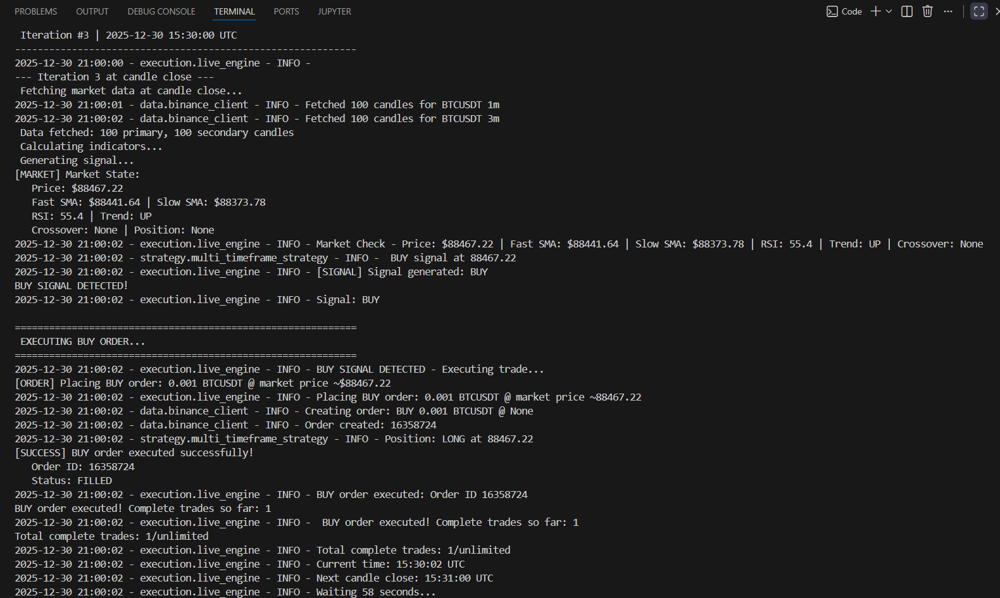
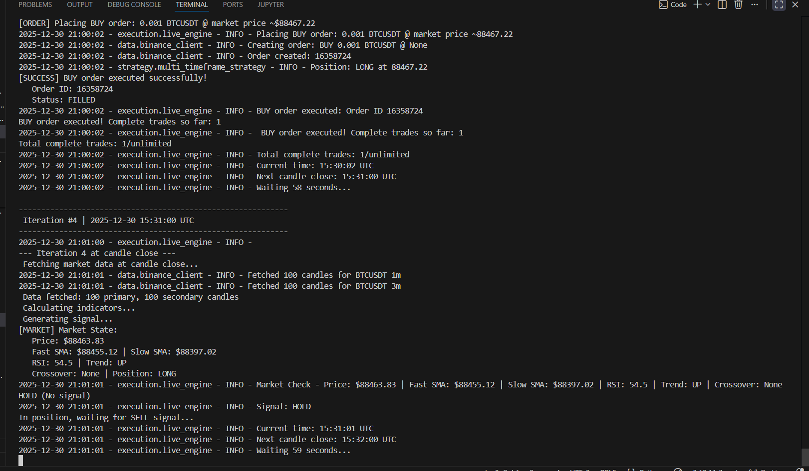
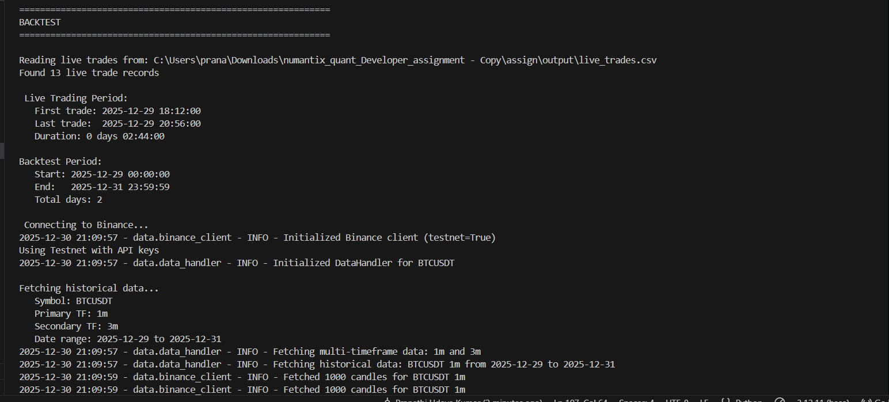
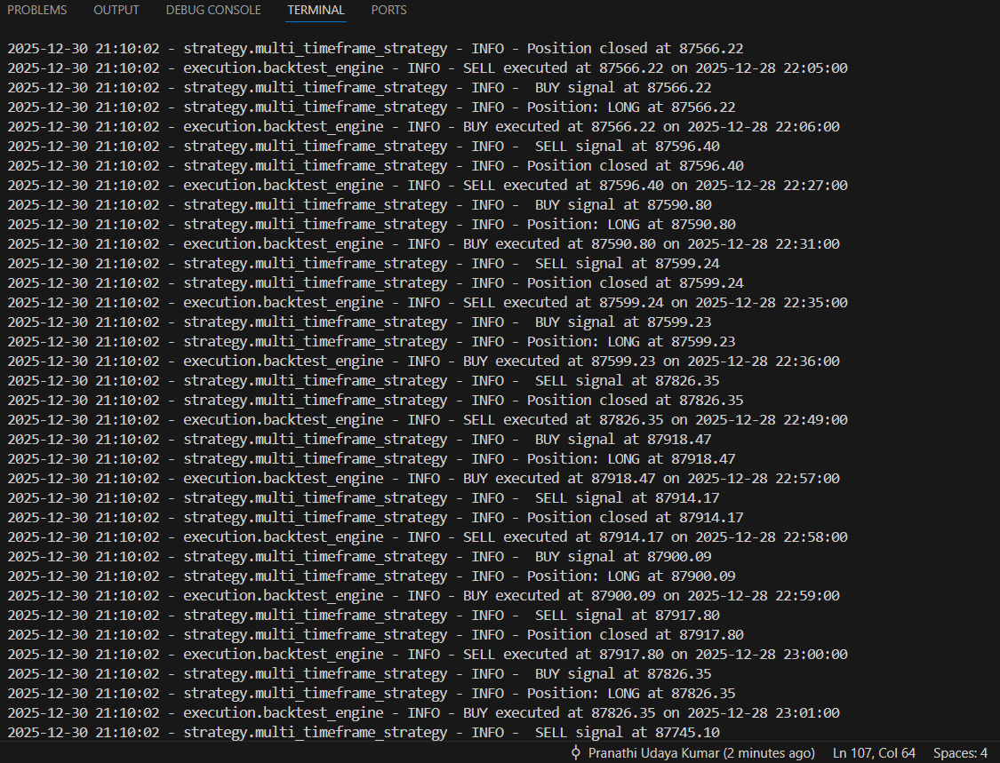

# Numatix Quant Developer Assignment

A algorithmic trading system with a multi-timeframe trading strategy with backtesting and live trading capabilities on Binance Testnet.

## Architecture Overview

This implementation follows a clean, modular, class-based architecture that ensures **identical strategy logic** between backtesting and live trading, achieving true execution parity.

### Core Principles

- **Single Source of Truth**: ONE strategy class (`MultiTimeframeStrategy`) used by BOTH backtesting and live trading
- **No Duplication**: Zero duplicate or reimplemented logic between backtest and live systems
- **Deterministic**: Fully rule-based strategy with candle-close logic (no lookahead bias)
- **Console output logs**: Proper error handling, logging, and observability

## Project Structure

```

├── config/
│   └── settings.py              # Centralized configuration
├── data/
│   ├── binance_client.py       # Binance Testnet REST API client
│   └── data_handler.py          # Multi-timeframe data fetching
├── execution/
│   ├── backtest_engine.py      # Backtesting engine (uses backtesting.py)
│   └── live_engine.py          # Live trading engine (Binance Testnet)
├── strategy/
│   └── multi_timeframe_strategy.py  # SINGLE strategy class (used by both)
├── utils/
│   ├── logger.py               # Structured logging
│   └── validators.py           # Trade matching and validation
├── scripts/
│   ├── backtest.py  # Run backtesting
│   ├── live.py      # Run live trading
│   └── match_trades.py # Compare backtest vs live trades
│   
└── output/                     # Generated outputs
    ├── backtest_trades.csv     # Backtest trade records
    ├── live_trades.csv         # Live trade records
    ├── logs/                   # Execution logs
    ├── matched_trades          # Matched trade records
    ├── validation.txt          # Validation report
    └── backtest_report.txt     # backtest report
```

## 1. Strategy Design (Multi-Timeframe)

### Strategy Logic

**NOT MUCH TRADES WERE GENERATED USING 15m and 1 hour TIMEFRAME SO I HAD LATER TRIED WITH LESSER VALUES<br>**

**Primary Timeframe (1m)**: Entry signals via SMA crossover
- Fast SMA (5 periods) and Slow SMA (10 periods)
- Bullish crossover: Fast SMA crosses above Slow SMA

**Secondary Timeframe (3m)**: Trend confirmation/filtering
- Trend SMA (50 periods)
- Uptrend: Price above Trend SMA

**Entry Rules (BUY)**:
1. Bullish crossover on 1m (Fast SMA crosses above Slow SMA)
2. Price above Trend SMA on 3M (uptrend confirmation)
3. RSI < 80 (not overbought)

**Exit Rules (SELL)**:
1. Bearish crossover on 1m (Fast SMA crosses below Slow SMA)
   OR
2. RSI > 80 (overbought condition)

**Trade Direction**: Long-only

**Position Sizing**: Fixed quantity per trade (configurable in settings)

### Implementation

The strategy is implemented in `strategy/multi_timeframe_strategy.py` as a single class that:
- Calculates indicators on both timeframes
- Generates deterministic signals based on candle-close data
- Maintains position state
- Uses no lookahead bias (only past/current candle data)

## 2. Architecture

### Class Responsibilities

**`MultiTimeframeStrategy`** (strategy/multi_timeframe_strategy.py)
- Single source of truth for all signal generation
- Used by BOTH backtest and live engines
- Methods: `calculate_indicators()`, `generate_signal()`, `update_position()`, `reset()`

**`BacktestEngine`** (execution/backtest_engine.py)
- Wraps `backtesting.py` library
- Feeds historical OHLCV data to strategy
- Executes trades based on strategy signals
- Records all trades with timestamps, prices, PnL

**`LiveTradingEngine`** (execution/live_engine.py)
- Polls Binance Testnet REST API for latest candles
- Feeds real-time data to the SAME strategy class
- Waits until candle close and then generates signals
- Places actual orders on testnet
- Records executed trades

**`BinanceClient`** (data/binance_client.py)
- REST API wrapper for Binance Testnet
- Handles authentication, request signing
- Methods: `get_klines()`, `create_order()`, `get_account_info()`

**`DataHandler`** (data/data_handler.py)
- Fetches multi-timeframe data
- Handles historical and real-time data retrieval
- Ensures data alignment between timeframes

### Execution Flow

**Live Trading**:
```
Binance Testnet API → LiveTradingEngine → MultiTimeframeStrategy.generate_signal() → Order Placement → Trade Recording → CSV
```

**Backtesting**:
```
Historical Data and the live trade time period → BacktestEngine → MultiTimeframeStrategy.generate_signal() → Trade Execution → CSV 
```

Both paths use the **exact same** `generate_signal()` method, ensuring parity.

## 3. Backtesting Implementation

### Technology
- Uses `backtesting.py` library for historical simulation
- Fetches historical OHLCV data from Binance Mainnet (public endpoint, no API key needed)

### Process
1. Fetch historical data for both timeframes (1m and 3m)
2. Initialize `MultiTimeframeStrategy` with parameters
3. Run backtest using `backtesting.py` framework
4. Strategy generates signals on each candle close
5. Trades executed based on signals
6. All trades logged with the following in the csv:
   - Timestamp
   - Symbol
   - Direction (BUY/SELL)
   - Entry price
   - Exit price
   - PnL and return %

### Output
- `output/backtest_trades.csv`: All executed trades
- `output/backtest_report.txt`: Performance summary (Sharpe ratio, win rate, drawdown, etc.)

### Usage
```bash
python scripts/run_backtest.py
```

## 4. Live Trading (Binance Testnet)

### Technology
- Binance Testnet REST API 
- Polls for candle-close data at configurable intervals
- Places real MARKET orders on testnet

### Process
1. Connect to Binance Testnet with API credentials
2. Initialize `MultiTimeframeStrategy` with same parameters as backtest
3. Poll for latest closed candles on both timeframes (waits till candle close)
4. Feed candles to strategy's `generate_signal()` method
5. If signal != 'HOLD', place order via REST API
6. Record executed trades with order ID and status

### Order Execution
- Uses `BinanceClient.create_order()` to place MARKET orders
- Records order response (orderId, status, executedQty)
- Logs order placement and execution confirmation

### Output
- `output/live_trades.csv`: All executed trades with order IDs

### Usage
```bash
python scripts/run_live.py
```

**Requirements**:
- Binance Testnet API keys
- Set in `config/settings.py` 
  - `BINANCE_TESTNET_API_KEY`
  - `BINANCE_TESTNET_API_SECRET`

## 5. Trade Matching & Validation
**PLease Note : While backtesting I have even considered other days also (previous day of the live execution , current day with extra one hour) , hence the number of trades is more.
But when compared with the live test time period , the trades match completely (Refer : Output/Validation.txt)**
### Purpose
Validates that backtest and live trading produce **identical signals** and similar execution, ensuring strategy parity.

### Matching Criteria
- **Sequence/Order**: Trades should occur in same sequence
- **Direction**: BUY/SELL should match
- **Price Tolerance**: ±2% acceptable (due to market execution vs backtest assumptions)
- **Time Tolerance**: ±5 minutes acceptable (due to candle close timing differences)

### Process
1. Load `backtest_trades.csv` and `live_trades.csv`
2. Match trades by sequence and direction
3. Compare entry/exit prices within tolerance
4. Calculate match rate
5. Generate detailed report

### Output
- `output/validation.txt`: Detailed comparison report
- Match rate percentage
- List of matched and unmatched trades
- Price and time differences

### Usage
```bash
python scripts/match_trades.py
```

## 6. Logging & Observability
### OUTPUTS 
**LIVE**



**BACKTEST**



### Structured Logging
All modules use centralized logging (`utils/logger.py`) with:
- Timestamped log files in `output/logs/`
- Console output for real-time monitoring
- Log levels: DEBUG, INFO, WARNING, ERROR

### Logged Events

**Signal Generation**:
- Market state (price, indicators, position)
- Signal decision (BUY/SELL/HOLD)
- Conditions met/failed

**Order Placement**:
- Order details (symbol, side, quantity, price)
- Order ID from exchange
- Order status

**Order Execution**:
- Fill confirmation
- Execution price
- Trade record creation


**The current log files even contain the files from the previous executions done while implementing. **
### Log Files
- `output/logs/backtest_YYYYMMDD_HHMMSS.log`: Backtest execution logs
- `output/logs/live_trading_YYYYMMDD_HHMMSS.log`: Live trading logs

## 7. Installation & Setup

### Prerequisites
- Python 
- Binance Testnet account (for live trading)

### Installation
```bash
pip install -r requirements.txt
```

### Configuration
Edit `config/settings.py`:
- Trading symbol (default: BTCUSDT)
- Timeframes (default: 1m primary, 3m secondary)
- Strategy parameters (SMA periods, RSI thresholds)
- Trade quantity


## 8. Usage Workflow

### Step 1: Run Live Trading
```bash
python scripts/live.py
```
Generates `output/live_trades.csv`
### Step 2: Run Backtest
```bash
python scripts/backtest.py
```
Generates `output/backtest_trades.csv`


### Step 3: Validate Parity
```bash
python scripts/match_trades.py
```
Generates `output/validation.txt`

## CSV Schemas

### backtest_trades.csv
```csv
timestamp,symbol,side,entry_price,exit_time,exit_price,size,pnl,return_pct
2024-12-01 10:00:00,BTCUSDT,BUY,45000.0,2024-12-01 11:30:00,45100.0,0.001,0.1,0.22
```

### live_trades.csv
```csv
timestamp,symbol,side,entry_price,quantity,order_id,status,exit_time,exit_price,pnl,return_pct
2024-12-01 10:00:00,BTCUSDT,BUY,45000.0,0.001,12345678,FILLED,2024-12-01 11:30:00,45100.0,0.1,0.22
```

## How Backtest-Live Parity is Ensured

1. **Same Strategy Class**: Both engines use `MultiTimeframeStrategy` - no code duplication
2. **Same Signal Method**: Both call `strategy.generate_signal()` with identical logic
3. **Candle-Close Logic**: Both use completed candles only (no lookahead)
4. **Deterministic Rules**: Strategy is fully rule-based with no randomness
5. **Identical Parameters**: Same SMA periods, RSI thresholds, etc.

### Expected Differences
- **Price Differences**: Live execution at market price vs backtest at candle close (±2% tolerance)
- **Timing Differences**: Candle close detection timing (±5 minutes tolerance)

### Known Limitations
- Long-only strategy (no short positions)
- Single symbol trading (BTCUSDT)

